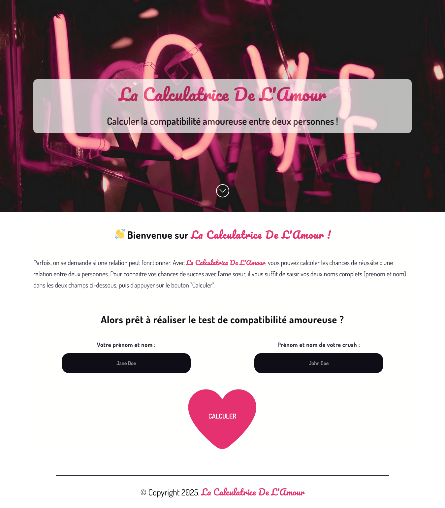

## 💕 LA CALCULATRICE DE L'AMOUR ❤️‍🔥

## Le challenge

Cette application vous permet de calculer la compatibilité amoureuse entre deux personnes.
Pour se faire, l'internaute doit saisir son noms complets (prénom et nom) ainsi que celui de son crush dans les deux champspuis d'appuyer sur le bouton "Calculer".
Le résultat apparaîtra sous forme de pourcentage et un commentaire vous aide a interpréter le pourcentage.

## Démonstration

Lien vers le projet : https://aperbet56.github.io/la_calculatrice_de_l_amour/

## Projet développé avec

- Utilisation des balises sémantiques HTML5
- CSS3
- Flexbox
- Commentaires HTML
- Commentaires CSS
- Animations css (@keyframes)
- Utilisation d'un normaliseur : le fichier normalize.css
- Desktop first
- Page web responsive
- Importation des polices "Dosis" et "Pacifico"
- Importation de la librairie 90s Cursor Effects (https://github.com/tholman/cursor-effects)
- JavaScript
- Code JavaScript commenté
- Regex
- Méthode test pour les regex
